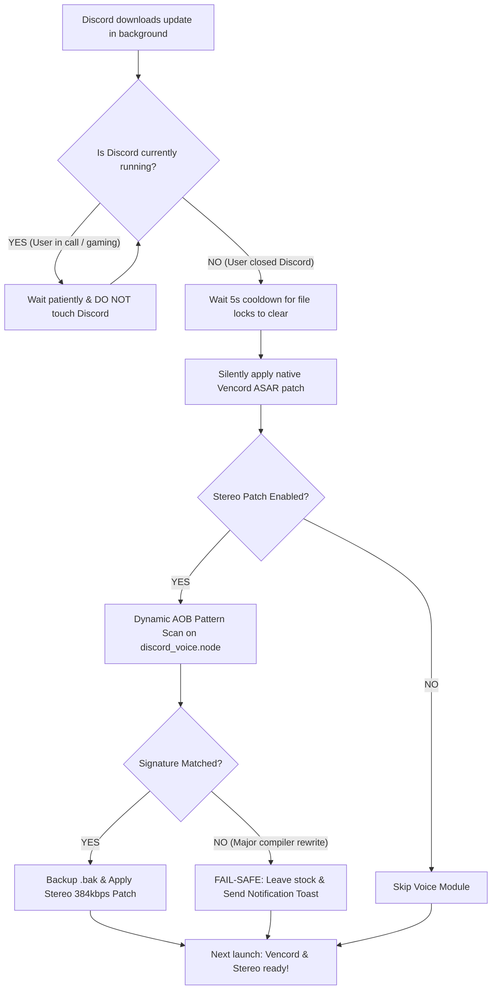

# 🎧 Vencord Graceful Patcher (+ True Stereo Voice Engine)

[](https://www.python.org/)
[](https://microsoft.com)
[](LICENSE)
[](https://discord.com)

> **The Discord-friendly auto-patcher for Vencord and True Stereo Audio.**  
> Automatically re-patches Vencord and restores high-fidelity stereo voice transmission through Discord updates — **without ever force-closing Discord mid-call or crashing on new builds.**

---

## 🚫 The Problem with Existing Updaters

Other community auto-patchers and audio installers (such as `BetterVencordPatch` and `Stereo.Installer`):
1. **Forcefully kill Discord:** Run `taskkill /F /IM Discord.exe` mid-game or mid-call the second an update downloads.
2. **Crash on New Builds:** Overwrite your local `discord_voice.node` with outdated binary dumps from months ago, causing Discord to crash on launch or get stuck in the infinite **"RTC Connecting..."** voice loop.
3. **Fail on Minor Updates:** Rely on fixed memory offsets that break the moment Discord updates.

---

## ✨ How Vencord Graceful Patcher Works



1. **Monitors Updates Silently:** Watches for newly downloaded Discord version folders (`app-1.0.xxxx`).
2. **Never Drops Calls:** If you are actively using Discord, it **never touches your process**.
3. **Patches When Closed:** The moment you close Discord or shut down your PC, it safely applies the Vencord patch and scans the voice engine.
4. **Dynamic AOB Voice Scanning:** Searches your *own local* `discord_voice.node` for machine code instructions to enable 2-channel stereo and 384kbps studio bitrate.
5. **Fail-Safe Protection:** If a major Discord update changes the voice engine assembly, it refuses to touch the file and alerts you via a native notification toast, ensuring Discord **never crashes**.

---

## 🚀 Features

* ⚡ **100% Standalone & Native:** Does **not** require downloading or compiling Vencord's 12MB Go installer! It constructs the byte-exact Electron ASAR loader natively in Python.
* 🎙️ **True Stereo & High Bitrate:** Bypasses Discord Desktop's native mono downmixer and Opus 1-channel lock, enabling true 2-channel 384kbps audio.
* 🛡️ **Fail-Safe Reliability:** If an update isn't recognized, Discord runs safely in stock mode instead of breaking.
* 📞 **Zero Voice Call Interruptions:** Never terminates your Discord session while you are active.
* 📦 **Zero External Dependencies:** Built entirely with Python's standard library (no `pip install` required).
* 🔕 **100% Invisible Background Execution:** Runs via `pythonw.exe` without command prompt popups.
* 🔄 **Multi-Branch Support:** Automatically monitors **Discord Stable**, **PTB**, **Canary**, and **Development**.
* 🔔 **Native Windows Toast Notifications:** Alerts you when an update has been smoothly patched (or debounces alerts if an update needs new signatures).
* 🛠️ **Status & Unpatch Tools:** Run `status.bat` to inspect patched builds, `stereo_status.bat` for audio engine status, or `unpatch.bat` to restore Discord to vanilla with 1 click.

---

## 📥 Installation

1. **Clone or Download** this repository:
   ```bash
   git clone https://github.com/sinny999s/VencordGracefulPatch.git
   ```
2. Double-click **`install.bat`**.

That's it! The patcher will automatically register in Windows Startup (`shell:startup`) and run silently in the background.

---

## ⚙️ Configuration (`config.json`)

You can customize behavior by editing `config.json`:

```json
{
  "check_interval_seconds": 10,
  "cooldown_after_close_seconds": 5,
  "show_notifications": true,
  "enable_stereo_patch": true,
  "relaunch_discord_after_patch": false,
  "custom_installer_path": "",
  "monitored_branches": [
    "stable",
    "ptb",
    "canary",
    "development"
  ]
}
```

| Setting | Default | Description |
| :--- | :--- | :--- |
| `check_interval_seconds` | `10` | How often (in seconds) the background service checks for updates. |
| `cooldown_after_close_seconds` | `5` | Wait time after Discord exits before patching (ensures file locks are cleared). |
| `show_notifications` | `true` | Shows a Windows desktop toast when Vencord or Stereo Audio is patched. |
| `enable_stereo_patch` | `true` | Enables dynamic pattern scanning for true stereo and 384kbps audio in `discord_voice.node`. |
| `relaunch_discord_after_patch` | `false` | Automatically restarts Discord after patching (leave `false` to respect your workflow). |
| `monitored_branches` | `["stable", ...]` | Which Discord release channels to monitor. |

---

## 🔍 Checking Status & Tools

* **Check Overall Status:** Double-click `status.bat` to see Vencord and Voice Module state.
* **Check Stereo Engine:** Double-click `stereo_status.bat` to see MD5, pattern matches, and backup status.
* **Revert Audio to Stock Mono:** Double-click `stereo_unpatch.bat` to restore the original backup.
* **View Logs:** Inspect `%LOCALAPPDATA%\VencordGracefulPatch\patcher.log`.

---

## 🗑️ Uninstallation

Double-click **`uninstall.bat`**. This cleanly terminates the background process and removes the launcher from Windows Startup.

---

## 📄 License

This project is licensed under the [MIT License](LICENSE).
