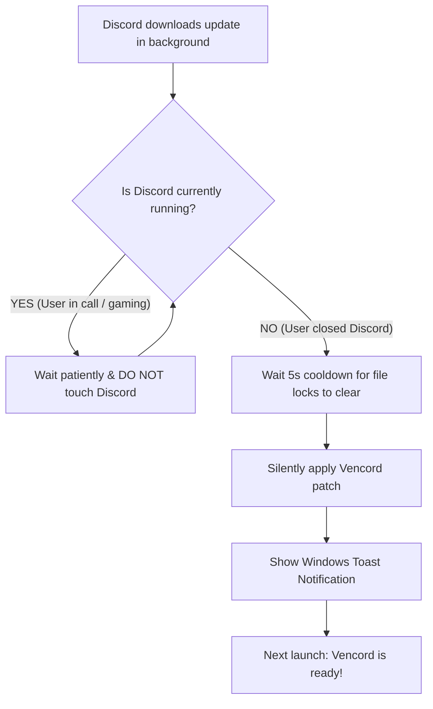

# 🎧 Vencord Graceful Patcher

[](https://www.python.org/)
[](https://microsoft.com)
[](LICENSE)
[](https://discord.com)

> **The Discord-friendly auto-patcher for Vencord.**  
> Automatically re-patches Vencord through Discord updates — **without ever force-closing Discord in the middle of a call.**

---

## 🚫 The Problem with Existing Updaters

Other community auto-patchers (such as `BetterVencordPatch` / `autovencordpatch.exe`) monitor your Discord folder and, the split-second Discord downloads an update in the background, they run:
```bat
taskkill /F /IM Discord.exe
```
This causes:
* **Dropped Voice & Video Calls:** Discord closes instantly without warning while you are speaking, gaming, or streaming.
* **Corrupted Updates:** Killing Discord while Squirrel is writing update files often breaks installations (`app.asar` missing or incomplete).
* **Unnecessary Relaunches:** Forcefully boots Discord back up even if you were about to close it.

---

## ✨ How Vencord Graceful Patcher Works

**Vencord Graceful Patcher respects Discord's built-in update lifecycle:**



1. **Monitors Updates Silently:** Watches for newly downloaded Discord version folders (`app-1.0.xxxx`).
2. **Waits for Discord to Exit:** If you are actively using Discord, it **never touches your process**.
3. **Patches When Closed:** The moment you close Discord or shut down your PC, it safely applies the Vencord patch.
4. **Instant on Next Launch:** When you reopen Discord, the new version launches with Vencord already active!

---

## 🚀 Features

* ⚡ **100% Standalone & Native:** Does **not** require downloading or compiling Vencord's 12MB Go installer! It constructs the byte-exact Electron ASAR loader natively in Python.
* 📞 **Zero Voice Call Interruptions:** Never terminates your Discord session while you are active.
* 📦 **Zero External Dependencies:** Built entirely with Python's standard library (no `pip install` required).
* 🔕 **100% Invisible Background Execution:** Runs via `pythonw.exe` without pesky command prompt popups.
* 🔄 **Multi-Branch Support:** Automatically monitors **Discord Stable**, **PTB**, **Canary**, and **Development**.
* 🔔 **Native Windows Toast Notifications:** Alerts you when an update has been smoothly patched.
* 🛠️ **Status & Unpatch Tools:** Run `status.bat` to inspect patched builds, or `unpatch.bat` to restore Discord to vanilla with 1 click.

---

## 📥 Installation

1. **Clone or Download** this repository:
   ```bash
   git clone https://github.com/your-username/VencordGracefulPatch.git
   ```
2. Double-click **`install.bat`**.

That's it! The patcher will automatically register in Windows Startup (`shell:startup`) and run silently in the background.

---

## ⚙️ Configuration (`config.json`)

You can customize behavior by editing `config.json`:

```json
{
  "check_interval_seconds": 10,
  "cooldown_after_close_seconds": 5,
  "show_notifications": true,
  "relaunch_discord_after_patch": false,
  "custom_installer_path": "",
  "monitored_branches": [
    "stable",
    "ptb",
    "canary",
    "development"
  ]
}
```

| Setting | Default | Description |
| :--- | :--- | :--- |
| `check_interval_seconds` | `10` | How often (in seconds) the background service checks for updates. |
| `cooldown_after_close_seconds` | `5` | Wait time after Discord exits before patching (ensures file locks are cleared). |
| `show_notifications` | `true` | Shows a Windows desktop toast when Vencord is patched. |
| `relaunch_discord_after_patch` | `false` | Automatically restarts Discord after patching (leave `false` to respect your workflow). |
| `custom_installer_path` | `""` | Path to a custom Vencord installer binary (leave blank for auto-detection). |
| `monitored_branches` | `["stable", ...]` | Which Discord release channels to monitor. |

---

## 🔍 Checking Status & Logs

* **Check Status:** Double-click `status.bat` to see which versions are installed and patched.
* **View Logs:** Double-click `view_logs.bat` to view `%LOCALAPPDATA%\VencordGracefulPatch\patcher.log`.

---

## 🗑️ Uninstallation

Double-click **`uninstall.bat`**. This cleanly terminates the background process and removes the launcher from Windows Startup.

---

## 📄 License

This project is licensed under the [MIT License](LICENSE).
